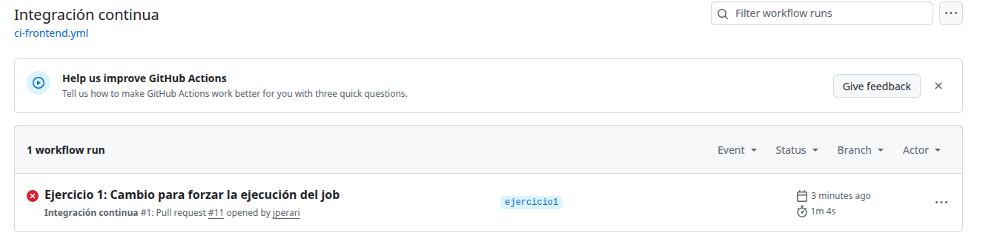
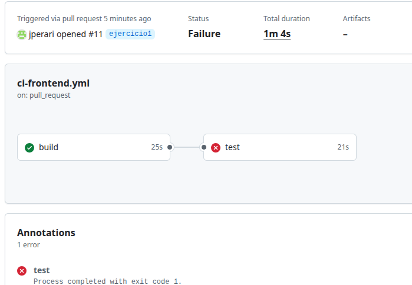
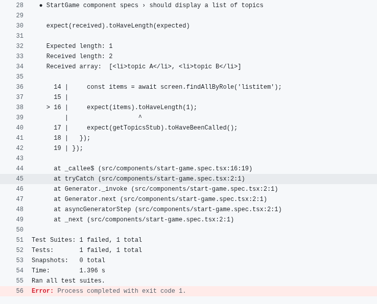
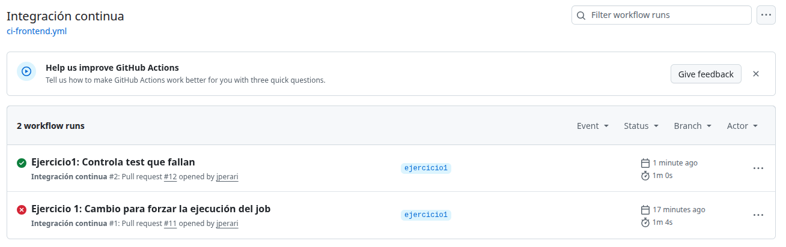

# Laboratorio 3 GitHub Actions

## Ejercicio 1. Workflow CI para el proyecto de frontend

En la clase hemos estado trabajando con el proyecto de la API, pero en este ejercicio trabajarás sobre el proyecto de frontend.

Debes crear un nuevo workflow que se dispare cuando haya cambios en el proyecto hangman-front y exista una nueva pull request (deben darse las dos condiciones a la vez). El workflow ejecutará las siguientes operaciones:

- Build del proyecto
- Ejecución de los test unitarios

### Comentarios

1. Disparador:

    Con el siguiente código se programa el flujo para ejecutarse cada vez que se haga un PR sobre cualquier rama y se modifique el contenido del proyecto frontend ubicado en la tura hangman-front, se podría limitar a main en nuestro caso porque la operativa será subir código desde ramas a main a través de PRs pero lo dejo abierto

    ```yml
    on:
      pull_request:
        #branches: [ main ]
        paths: [ 'hangman-front/**' ]
    ```

2. Construcción del proyecto

    En jobs se añade el job con nombre 'build' para bajar el código del repositorio y lanzar los comando de node.js para bajar dependencias y construir el proyecto

    ```yml
      build:
        runs-on: ubuntu-latest

        steps:
        - name: Checkout del repositorio
            uses: actions/checkout@v6
        
        - name: Configurar Node.js
            uses: actions/setup-node@v6
            with:
            node-version: 18

        - name: Build
            working-directory: ./hangman-front
            run: |
            npm ci
            npm run build

    ```

3. Ejecución de los test unitarios

    Añadimos otro job para ejecutar las pruebas unitarias de forma similar al anterior

    ```yml
      test:
        runs-on: ubuntu-latest
        needs: build

        steps:
        - name: Checkout del repositorio
            uses: actions/checkout@v6

        - name: Configurar Node.js
            uses: actions/setup-node@v6
            with:
            node-version: 18

        - name: Ejecutar los unit tests
            working-directory: ./hangman-front
            run: |
            npm ci
            npm run test
    ```

    **NOTA:** Utilizando dos jobs el proceso es más escalable pero consume más recursos, como los dos primeros steps son comunes, se podría añadir el último step del job 'test' al final de los steps del primer job. El tenerlos por separado hace que se creen dos instancias de ubuntu, se baje dos veces el código y se configure node.js y se bajen las dependencias dos veces.

4. Evidencias de la ejecución

* Subo los cambios (solo ci-fontend.yml) y hago PR -> No se lanza el job
* Modifico el fichero index.html y hago PR -> Se lanza el job aunque da un error al ejecutar los tests:

    
    
    

* Modifico el fichero que falla: `start-game.spec.tsx` para saltar la comprobación, añado esto:

    ```JavaScript
    try {
        expect(items).toHaveLength(1);
        expect(getTopicsStub).toHaveBeenCalled();
    } catch (e) {
        console.warn('Test fallido (ignorado en demo)');
    }
    ```

    


## Ejercicio 2. Workflow CD para el proyecto de frontend

Crea un nuevo workflow que se dispare manualmente y haga lo siguiente:

- Crear una nueva imagen de Docker
- Publicar dicha imagen en el container registry de GitHub
  
Nota: intenta usar las actions de Docker vistas en clase

### Comentarios

## Ejercicio 3. Workflow para ejecutar tests E2E (opcional)

Crea un workflow que se lance de la manera que elijas y ejecute los tests e2e que encontrarás en este enlace. Puedes usar Docker Compose o Cypress action para ejecutar los tests.

### Comentarios